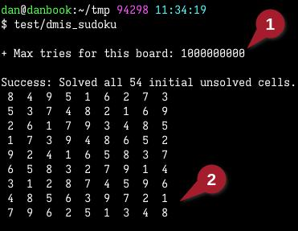
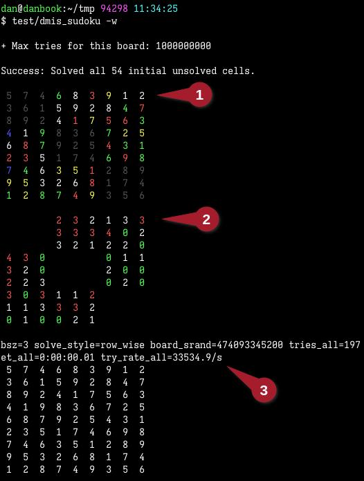
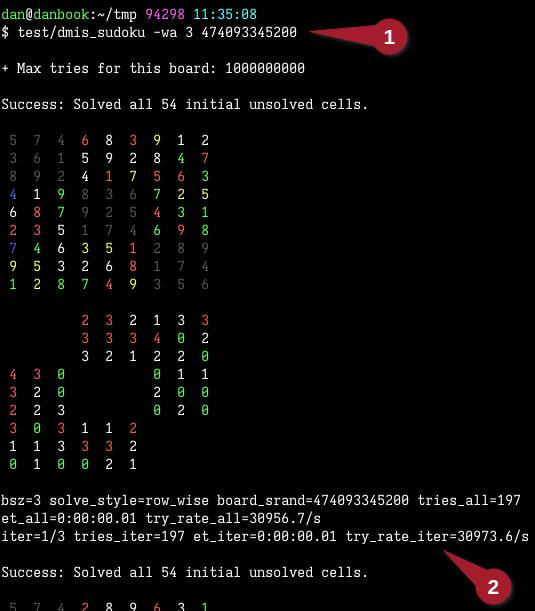

# sudoku-rb

## Description
This is a research project. I've been using it for a few years to test out different ideas to optimize Ruby code, and to just exercise my noodle with the challenges of generating random Sudoku puzzles with large sizes.

## Usage
For a quick start, here are some annotated screenshots.

### Most basic
In the most basic form, simply running the tool with no parameters generates a typical 9x9 Sudoku board:



Annotation Notes:
- <span style="background-color: #900; color: white">(1)&gt;</span> There are some cases where the tool has to make millions or billions of guesses from a random starting point. To avoid running too long while stuck on a single puzzle, the tool sets a hard limit on total guesses before giving up, based on the puzzle size.
   - **Note** that any messages like this, which are **not** a solved puzzle, are always written to `stderr`, so the final solved puzzle output on `stdout` is not polluted and can be saved.
- <span style="background-color: #900; color: white">(2)&gt;</span> The final solved board(s) are always written to `stdout`.
   - You could keep a running collection of all the solved boards with something like this:<br>`$ dmis_sudoku | tee -a saved_boards.txt`
   - **Note** this version does not load previously generated boards, but a later version will do so.

### Watching the runtime
For the next level, we add the `-w` flag (or `--watch`) to watch the generation:



Annotation Notes:
- <span style="background-color: #900; color: #fff">(1)&gt;</span> With `-w` enabled, the tool will show the state of the board as it's being solved, and the state of the code run.
   - The first colored section is the board itself. The colors are:
      - Gray <span style="background-color: #000; color: #777">&raquo;&raquo;&raquo;</span> The initial seeded values on the board before guessing started. One property of Sudoku boards is that these NxN blocks on a diagonal have no effect on each other, so their contents can always be 1-N in any order. This is a good way to seed the board with random yet guaranteed valid values before guessing starts.
      - White <span style="background-color: #000; color: #fff">&raquo;&raquo;&raquo;</span> The value has no significant property that would override with a different color.
      - Blue <span style="background-color: #000; color: #33f">&raquo;&raquo;&raquo;</span> The value is at the top-left of an NxN block, with no other significant property that would override with a different color.
      - Green <span style="background-color: #000; color: #3f3">&raquo;&raquo;&raquo;</span> The value is the last possible guess at its given position. If all guesses in the next position are exhausted, then this value will reset to its first possible guess, and the position before it will have to use its next guess.
      - Yellow <span style="background-color: #000; color: #ff3">&raquo;&raquo;&raquo;</span> Like Green, except it's the 2nd-last possible valid guess at its position.
      - Red <span style="background-color: #000; color: #f33">&raquo;&raquo;&raquo;</span> Like Green, except it's the 3rd-last possible valid guess at its position.
- <span style="background-color: #900; color: #fff">(2)&gt;</span> The second colored section shows the state of each guess.
   - The initial seeded values (gray above) are blank, because they are not touched when guessing.
   - The values are the actual distance from the current guess to the last possible guess at that position.
   - The colors are:
      - Green <span style="background-color: #000; color: #3f3">&raquo;&raquo;&raquo;</span> The guess at this position is the last possible guess. This is similar to the Green indicator in the section above.
      - Red <span style="background-color: #000; color: #f33">&raquo;&raquo;&raquo;</span> The guess at this postion is the first possible guess. These guesses are most likely to be wrong.
      - White <span style="background-color: #000; color: #fff">&raquo;&raquo;&raquo;</span> The guess at this position is somewhere in the middle of its range.
- <span style="background-color: #900; color: #fff">(3)&gt;</span> Status lines show extra details.
   - The first 3 values shown are the parameters for this run. You can reuse these values to reproduce the same boards and guesses later. These are:
      - `bsz`: The block size for the board. This is the 1st non-option command param.
      - `solve_style`: The pattern used to sequence guesses. This is the `-s` param, and defaults to `row_wise`.
      - `board_srand`: The random seed value for generating the board. This is the 2nd non-option command param.
   - The other values are informational during the run. These become useful for large boards that take a long time to solve:
      - `tries_all`, `et_all`, `try_rate_all`: Total count, elapsed time, and rate speed of all guesses made.

### Watching and finding all solutions
For the next level, we add the `-a` flag (or `--all`) to find all possible solutions:



Annotation Notes:
- <span style="background-color: #900; color: #fff">(1)&gt;</span> Here we reused the param values reported on the previous run, to repeat the same random number sequences.
   - These values, `3` and `474093345200` are the `bsz` and `board_srand` params.
   - You can see the first board in the status is exactly the same as the previous run.
- <span style="background-color: #900; color: #fff">(2)&gt;</span> There is an extra status line in this mode, which displays details for the current iteration.
   - These match the `*_all` values, with the added `iter` value.
   - For this board, this is 1 of 3 possible "iterations", which may or may not be solutions.

## Full usage

```text
$ dmis_sudoku --help

Online help.

Description:
  Create random Sudoku puzzles of any size.

Usage:
  dmis_sudoku [-a|--all] [-h|-?|--help] [-S|--slow MILLISECS] \
      [-s|--solve-style STYLE] [-T|--throttle SECS] [-w|--watch] \
      [block_size [board_rand_seed [guess_rand_seed]]]

Where:
  --all, -a => Try to find all possible solutions. Default is only first
      solution.

  --help, -?, -h => This text.

  --slow, -S => Slow down with given millisecs between guesses.
      Useful with --throttle of 0.

  --solve-style, -s => Use the given board pattern sequence for guesses when
      solving, for researching. Style names are:
        row_wise, col_wise, row_wise_reverse, col_wise_reverse
      Default is row_wise. See `solve_styles.rb` for full details.

  --throttle, -T => Specify seconds between progress updates. Default 3.
      0 shows every board change.

  --watch, -w => During puzzle creation, display progress of the board.
      TODO: Describe watch output.

  block_size => Size of one block of the puzzle. Minimum is 2. Default is 3,
      which makes the usual 9x9.

  board_rand_seed => For testing, allow using the same random seed for the
      board across runs. Default is a random 12 digit integer.
      Use --watch to display the seed value to use again.

  guess_rand_seed => For testing, allow using the same random seed for initial
      guesses across runs. Default is the same as board_rand_seed.
      Use --watch to display the seed value to use again.

Sample params:
  bsz=5 solve_style=col_wise_reverse board_srand=473238364308 tries_all=2328128
  bsz=5 solve_style=col_wise_reverse board_srand=671801876774 tries_all=63830460
  bsz=5 solve_style=row_wise         board_srand=473238364308 tries_all=376975130
  bsz=5 solve_style=col_wise         board_srand=473238364308 tries_all=1217488955
  bsz=5 solve_style=col_wise_reverse board_srand=933262306056 tries_all=2515027231
```

## Installation

- This code requires a new Ruby, version 3.3. This is because it wants the new YJIT runtime.<br>You *might* be able to run it with minor changes on Ruby 3.1. But honestly with [rbenv](https://github.com/rbenv/rbenv) it's easy to have any version of Ruby you want.
- The only Rubygem needed is `zeitwerk`. If you run the tool and see something like this, then just follow the instruction:
   ```
   $ test/dmis_sudoku
   Gem::MissingSpecError: Could not find 'zeitwerk' (~> 2.0) among 85 total gem(s)
   Checked in 'GEM_PATH=/home/dan/.local/share/gem/ruby/3.3.0:/opt/rbenv/versions/3.3.5/lib/ruby/gems/3.3.0' , execute `gem env` for more information:

   Please run: gem install zeitwerk -v '~> 2.0'
   ```
- There is no build, or gem download, or anything else. This tool is designed without extra dependencies to run from whatever dir it's in. Only the `lib/` subdir is required in the same dir as the `dmis_sudoku` file.

## Notes

- I have generated a few 25x25 Sudoku boards. In some cases it ran overnight to solve a single board.
- Over time, with improvements in the code and in Ruby itself (and my laptop), performance has increased from a max of ~600K guesses per second to ~2M guesses per second (for 25x25) as of Oct 2024.
- The solution-style can make a surprising difference in how fast a board is solved, and how fast guesses are made. You can see in the `Sample params` section of `Full usage` above, 3 of the results use the same random seed, but require wildly different total guesses.
- Future plans:
   - Complete the port to [Crystal](https://crystal-lang.org) and post to Github.<br>I have a working Crystal port for an earlier version of this Ruby, but I need to redo it and include all the features here.<br>Crystal is **awesome**. It is basically Ruby syntax, which makes **lovely readable code**, with defined-type support and compile-time nil-ref checking and faster runtime than Golang.
   - Support more solution-styles, like using partially random or diagonal line sequences for the positions being guessed.
   - The ultimate goal would be some heuristics that decrease the likelihood of "bad" guesses early, which cause runtimes to explode for later guesses that must unwind all the way back.
   - It would be really cool to generate 36x36 or even 49x49 boards.
   - Add concurrency. Use multiple CPUs to solve a board.
   - Import any Sudoku board from a text file, and validate and solve it as usual.
   - Support masks for solved boards, with different difficulty levels, to generate actual puzzles for humans to print and solve.
   - Support crazy extra rules on board solutions, like the puzzles the world champion level Sudoku players can do.
   - Support non-square boards.

## Contributing

Of course, if you like. If you have some ideas, just click the [Issues](https://github.com/lilole/sudoku-rb/issues) tab above and we'll go from there.

Cheers.
